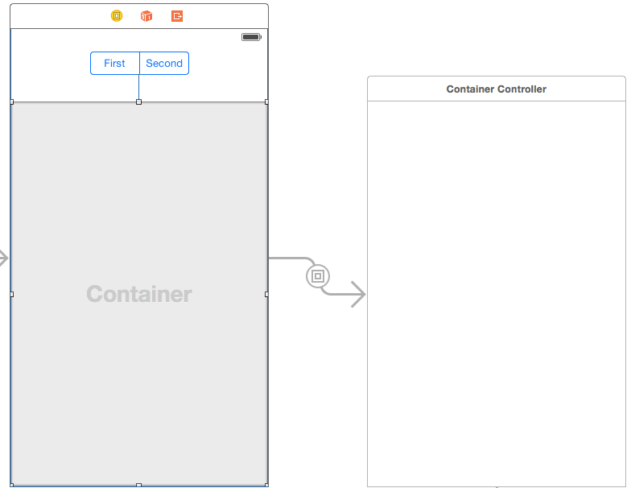
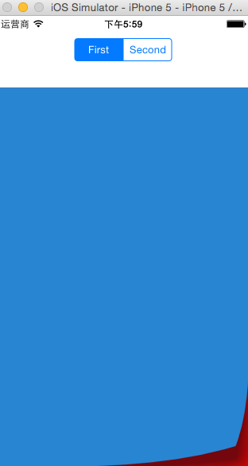
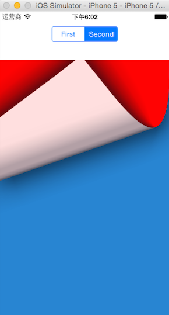
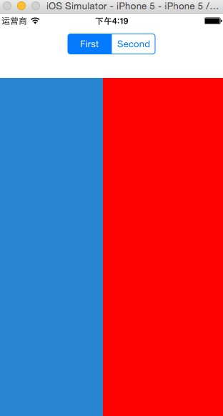

#自定义 children view controller 动画

新建 Single-View Application。
新建 3 个 UIViewController : ContainerController、FirstController、SecondController。

## 1. UI
打开 Main.storyboard：

在 ViewController 上拖入一个 SegmentControl、一个 Container View，Container View 会自带一个 UIViewController，将这个 UIViewController 的 Class 改为 ContainerController。



注意，将 SegmentControl 连接到 segSwitch 变量，valueChanged 事件连接到 switchControllerAction 方法；将 segue identifier 设置为 ContainerController。

## 2. EmptySegue

新建一个类 EmptySegue,继承 UIStoryboardSegue:

```swfit
import UIKit

@objc(EmptySegue)
class EmptySegue: UIStoryboardSegue {
    override func perform(){
        
    }
}
```
这个 segue 其实是空实现，只是一个占位符，便于使用我们自定义的 segue 动画。
## 3. 使用 EmptySegue

回到故事板，拖入两个 UIViewController,将 Class 分别改为 FirstController 和 SecondController，然后将背景色分别设置为红色和蓝色已示区分。

从 ContainerController 分别拖两个 segue 到 FirstController 和 SecondController，segue 类型都选择 empty（即新建的 EmptySegue）。对应地，将 segue identifier 分别命名为 FirstController 和 SecondController。

## 4. ViewController

声明一个属性：

```swift
var containerVC:ContainerController?
```

重载 prepareForSegue 方法：

```swift
	override func prepareForSegue(segue: UIStoryboardSegue, sender: AnyObject?) {
        if segue.identifier == "ContainerController" {
            containerVC = segue.destinationViewController as? ContainerController
        }
    }
```

目的是当导航发生时能够将目标 viewcontroller 转换为 一个 ContainerController并赋给 containerVC 变量。

然后实现 segmentcontrol 的 action：

```swift
	@IBAction func switchControllerAction(sender: AnyObject) {
        // 通知 ContainerController 在两个 childViewController 之间切换
        containerVC?.swapViewControllers()
    }
```
这里调用 ContainerController 的 swapViewControllers 方法切换两个子控制器 firstcontroller 和 secondcontroller。

## 5. ContainerController

1. 声明常量保存两个 segue identifier:

	```swift
	let segue1 = "FirstController"
	let segue2 = "SecondController"
	```
 
2. 声明属性记录当前显示的 segue:

	```swift
	var currentSegue:String?
	```
	
3. 在 viewDidLoad 中,首先默认显示 FirstController：

	```swift
	currentSegue = segue1
	self.performSegueWithIdentifier(currentSegue!, sender: nil)
   ```
4. 实现 swapViewControllers 方法：

	```swift
	func swapViewControllers(){
        currentSegue = (currentSegue == segue1) ? segue2 : segue1;
        performSegueWithIdentifier(currentSegue, sender:nil)
    }
    ```
    这里将 currentSegue 在 segue1 和 segue2 之间切换，然后调用 preformSegueWithIdentifier 方法将导航切换至相应的 segue。
    
5. 覆盖方法 prepareForSegue 方法，这个方法在调用 performSegueWithIdentifier 时触发：

	```swift
	override func prepareForSegue(segue: UIStoryboardSegue, sender: AnyObject?) {
        let destVC = segue.destinationViewController as! UIViewController
        // 1
        if (self.childViewControllers.count > 0) {
            swapFromViewController(childViewControllers[0] as! UIViewController,toViewController:destVC)
           
        }else {// 2
            // 在添加 destVC.view 的同时，把 destVC 也添加到 childViewControllers 中
            addChildViewController(destVC)
            
            destVC.view.frame = CGRectMake(0, 0, self.view.frame.size.width, self.view.frame.size.height)
            // 3
            self.view.addSubview(destVC.view)
            // 通知 destVC 它已经添加到 parent
            destVC.didMoveToParentViewController(self)
        }
    }
    ```
    在这个方法中：
    
    1. 首先判断 childViewControllers 数组是否为空。如果 childViewControllers 不为空，表明此时起码显示有一个 view controller（要么 FirstController，要么 SecondController），那么此时我们用第一个 childViewController 和导航的目标 ViewController 进行交换。将第一个子控制器和 segue 的目标 controller 进行切换并导航到目标 controller。
    2. 另外还有一种情况，即 childViewControllers 中没有控制器（即 ContainerController 第一次加载时），则先把目标 contorller (一般就是 FirstController)添加到 childViewControllers 数组，然后设置目标 controller 的 view 大小。
    3. 同时把目标 controller 的 view 添加到 ContainerController 的 view 中。
    4. 最后调用目标 controller 的 didMoveToParentViewController 方法，通知目标控制器：我们已经将你添加到 parentViewController（即self) 中，请进行后续的工作（比如播放动画）。这一点是苹果规定的动作，即每次用 addSubview 添加子控制器 view 之后总是得这么做。
    
6. 然后就是实现 swapFromViewController 方法了：

	```swift
	func swapFromViewController(fromViewController:UIViewController,toViewController:UIViewController){
        // 1
        toViewController.view.frame = CGRectMake(0, 0, self.view.frame.size.width, self.view.frame.size.height);
        // 2
        fromViewController.willMoveToParentViewController(nil)
        // 3
        addChildViewController(toViewController)
        // 4
        transitionFromViewController(fromViewController, toViewController: toViewController, duration: 0.4, options: UIViewAnimationOptions.TransitionCurlUp, animations: nil) { (finished) -> Void in
            // 5
            fromViewController.removeFromParentViewController()
            // 通知 toViewController 它已经添加到 parent
            toViewController.didMoveToParentViewController(self)
        }
    }
	
	```
	在这个方法中：
	
	1. 首先设置 toViewController （即要显示的 viewcontroller）的 view 大小（当然就是 ContainerController 的大小）。
	2. 然后通知 fromViewController（即要移除的 viewcontroller）：即将清空你的 parentViewController（即设置为 nil）。这也是 API 的规定动作。因为在后面（动画结束块中）我们会 removeFromParentViewController，即将 fromViewController 从父控制器中移除，这会导致 fromViewController 的 parenetViewController 清空，因此我们要提前通知 fromViewController: 你的 parentViewController 将被设置为 nil，好让它做一些准备（比如播放动画）。
	3. 将 toViewController 加入 childViewControllers 中。
	4. 进行转换动画，这是通过 transitionFromViewController 方法进行的，其中 UIViewAnimationOptions.TransitionCurlUp 表示这是一个向上进行翻页的转换动画。这个方法需要提供一个动画完成块，当动画播放完后，会调用这个块。
	5. 移除 fromViewController。即调用 removeFromParentViewController。
	6. API 还有一个规定动作：通知 toViewController 它已经添加到 parent。这和前面是一样的，即每次将子控制器添加到父控制器之后，都需要调用这个方法。也就是说，无论是调用过 addChildViewController 还是 addSubView 方法之后，总要调用对应子控制器的 didMoveToParentView之前，总是要调用对应子控制器的 willMoveToParentViewController(nil)。

7. 运行程序，点击 segment control 页面切换效果如下：





## 自定义动画

UIViewAnimationOptions 内置了一些动画，比如前后翻页，上下翻页，内部溶解等，但不提供模仿导航控制器的左右滑动动画。我们可以通过自定义动画来解决。

###1. 初步实现

在 方法中，将这句：

```
toViewController.view.frame = CGRectMake(0, 0, self.view.frame.size.width, self.view.frame.size.height);
```
修改为：

```swift
toViewController.view.frame = CGRectMake(view.frame.width,0, view.frame.width, self.view.frame.height);
```

这表明在动画开始之前，toViewController 的位置在屏幕以外的右侧（不可见）

然后将 transitionFromViewController 方法调用修改为：

```swift
transitionFromViewController(fromViewController, toViewController: toViewController, duration: 0.4, options: nil, animations: {()->Void in
            fromViewController.view.frame = CGRectMake(0 - self.view.frame.width, 0, self.view.frame.width, self.view.frame.height);
            toViewController.view.frame = CGRectMake(0, 0, self.view.frame.width, self.view.frame.height);
            }) { (finished) -> Void in
            // 移除 fromViewController
            fromViewController.removeFromParentViewController()
            // 通知 toViewController 它已经添加到 parent
            toViewController.didMoveToParentViewController(self)
        }

```

注意，我们将 options 设置为 nil，表明我们不只使用任何默认的动画，然后将 animations 参数由 nil 修改为：

```swift
{()->Void in
            fromViewController.view.frame = CGRectMake(0 - self.view.frame.width, 0, self.view.frame.width, self.view.frame.height);
            toViewController.view.frame = CGRectMake(0, 0, self.view.frame.width, self.view.frame.height);
            }
```
第一句将 fromViewController 移除屏幕左侧，第二句将 toViewController 移到正常的 0，0 位置。

运行程序，切换 segmentcontrol 效果如下：



###2. 改进

这个动画太线性了，一点弹性都没有，我们可以将 transitionFromViewController 中的 options 修改为 UIViewAnimationOptions.CurveEaseOut 试试，你会发现动画以一种由快渐慢的方式进行。这就是曲线动画，它们由 UIViewAnimationOptions.CurveXXXX 命名的枚举变量控制:

* .CurveEaseIn 渐进，以慢速开始，逐渐加快。即“慢-快”。
* .CurveEaseOut 渐出效果，以慢速结束。即“快-慢”。
* .CurveEaseInOut 渐进渐出，即“慢-快-慢”。
* .CurveLinear 线性，即匀速。

此外，我们应当针对不同的 segue 执行不同方向的 push，比如 segue1 让动画从左边推入，segue2 让动画从右边推入。有了前面的基础，这个其实很好实现。 仍然是 swapFromViewController，将 "fromViewController.view.frame = CGRectMake(0 - self.view.frame.width, 0, self.view.frame.width, self.view.frame.height);" 一句修改为：

```swift
if currentSegue == segue1 {// 如果导航到 FirstController（也就是 toViewController 就是 FirstController）
            toViewController.view.frame = CGRectMake(0-view.frame.width,0, view.frame.width, self.view.frame.height);
        }else{// 如果导航到 SecondController（即 toViewController = SecondController)
            toViewController.view.frame = CGRectMake(view.frame.width,0, view.frame.width, self.view.frame.height);
        }
```

也就是判断当前要显示的是 FirstController 的话，一开始让 FirstController 的位置放在屏幕左侧以外，这样的话开始后就形成从“左边”推入的效果。否则反之。

然后在 animations 块中，将“fromViewController.view.frame = CGRectMake(0 - self.view.frame.width, 0, self.view.frame.width, self.view.frame.height);”一句修改为：

```swift
if self.currentSegue == self.segue1 {// 如果导航到 FirstController（也就是 toViewController 就是 FirstController）
                fromViewController.view.frame = CGRectMake(self.view.frame.width, 0, self.view.frame.width, self.view.frame.height);
            }else{// 如果导航到 SecondController（即 toViewController = SecondController)
                fromViewController.view.frame = CGRectMake(0 - self.view.frame.width, 0, self.view.frame.width, self.view.frame.height);
            }
```

这是最终效果：

<div markdown="1">
    <video width="99%" height="320" autoplay loop muted markdown="1">
        <source src="6.mp4" type="video/mp4" markdown="1" >
    </video>
</div>
